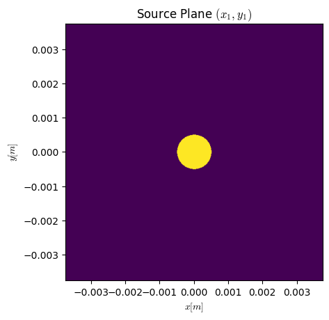
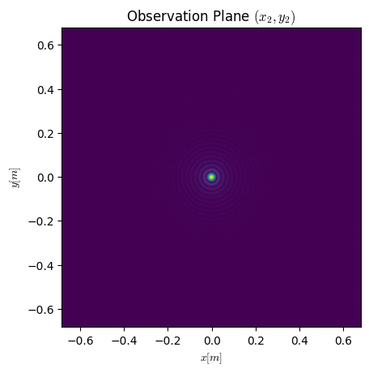

# Numerical Simulation of Optical Propagation Python Repository

The repository aims to **simulate optical propagation in turbulent media**.\
This is based on Jason Schmidt's book on 'Numerical Simulation of Optical Propagation'. The book can be found on the [SPIE digital library](https://www.spiedigitallibrary.org/ebooks/PM/Numerical-Simulation-of-Optical-Wave-Propagation-with-Examples-in-MATLAB/eISBN-9780819483270/10.1117/3.866274)

## optprop

Source Plane - Circular Aperture $(x_1,y_1)$             |  Observation Plane - Fraunhofer Propagation $(x_2,y_2)$
:-------------------------:|:-------------------------:
  |  

Simulation Parameters:
| Symbol | Meaning | Value
|---|---|---|
| $N$ | Number of samples | 512
| $L$ | Source grid length [m] | 7.5e-3
| $\lambda$ | Wavelength [m] | 1e-6
| $D$ | Circular Aperture Diameter [m] | 1e-3
| $\Delta z$ | Distance between source and observation plane [m]| 20

## Repository Purpose
This repo is simply for my own eduction into Github, Python, and Optics. I am not affiliated with J. Schmidt but I am thankful of his work!

## Setup
The initial setup is recommended to prevent relative import errors and avoids `sys.path.insert()` hacks.
[See here](https://stackoverflow.com/questions/6323860/sibling-package-imports/50193944#50193944). The package is now updated using setuptools.
- Clone the repository with `git clone`
- Activate virtual environment
- Navigate to the repository using `cd`
- Run `pip install -e .`

## Additional Notes
The repository should be updated periodically.
